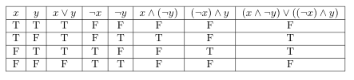

# Truth Table Generator
This repository contains a script that could generator the latex code of a truth table based on user input

# Usage
Clone this repository first. Then get into the directory and run the script
```
git clone git@github.com:AlpacaMax/TruthTableGenerator.git
cd TruthTableGenerator
python3 truthTableGen.py
```

Here I'm gonna use this truth table as an example.



First, it will ask you to enter all the boolean variables. Remember to separate them with spaces:
```
Enter all the boolean variables separated with spaces: x y
```

Second, type all the boolean expressions that needs to be evaluated. These expressions need to be typed in latex. Also remember to put a space after left parentheses and before right parentheses. 

```
(x\wedge\neg y)\vee((\neg x)\wedge y)          # WRONG
( x \wedge \neg y ) \vee ( ( \neg x ) \wedge y )    # CORRECT
```
The reason for that is because the script have to distinguish different operators and parentheses based on the spaces around them
```
Enter boolean expression, enter 'stop' to stop the query: x \vee y
Enter boolean expression, enter 'stop' to stop the query: \neg x
Enter boolean expression, enter 'stop' to stop the query: \neg y
Enter boolean expression, enter 'stop' to stop the query: x \wedge ( \neg y )
Enter boolean expression, enter 'stop' to stop the query: ( \neg x ) \wedge y
Enter boolean expression, enter 'stop' to stop the query: ( x \wedge \neg y ) \vee ( ( \neg x ) \wedge y )
Enter boolean expression, enter 'stop' to stop the query: stop
```

Then it will output the latex code of the truth table.
```
\[
\begin{tabular}{|c|c|c|c|c|c|c|c|}
\hline
$x$ & $y$ & $x \vee y$ & $\neg x$ & $\neg y$ & $x \wedge ( \neg y )$ & $( \neg x ) \wedge y$ & $( x \wedge \neg y ) \vee ( ( \neg x ) \wedge y )$\\
\hline
T & T & T & F & F & F & F & F\\
\hline
T & F & T & F & T & T & F & T\\
\hline
F & T & T & T & F & F & T & T\\
\hline
F & F & F & T & T & F & F & F\\
\hline
\end{tabular}
\]
```
Copy and paste it into your latex editor and you will get your result.

# Reminder
- This script current supports:
  - \wedge : and
  - \vee : or
  - \neg : not
  - \rightarrow : if-then
  - () : parentheses
- If you have any questions, please ask me